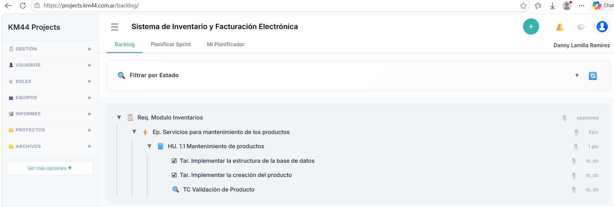
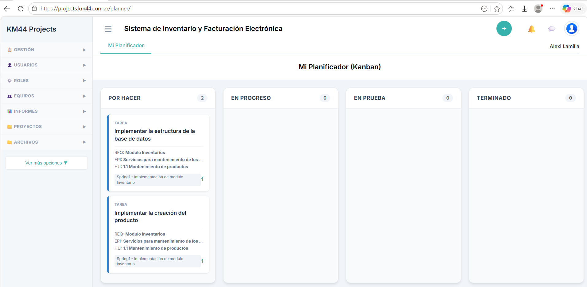
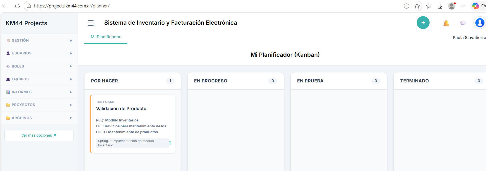

# Proyecto Scrum - Sistema de Inventario y Facturación Electrónica

## Descripción
Proyecto desarrollado utilizando metodología Scrum para la gestión de inventario y facturación electrónica mediante microservicios.

---

# Equipo de Trabajo

| Integrante | Rol |
|---|---|
| Alexi Lamilla | Desarrollador |
| Jersson Lamilla | Product Owner |
| Paola Salvatierra | QA Tester |
| Sheyla Lamilla | Scrum Master |

---

# Requerimiento

## Módulo de Inventarios

Desarrollar microservicios que permitan gestionar todas las funcionalidades correspondientes al control de inventario de productos y mantenimiento de los mismos.

### Alcance
- Ingreso de productos por compras a proveedores o devoluciones de clientes
- Egreso de productos por ventas a clientes o devoluciones a proveedores
- Reportes de stock
- Reportes de productos más vendidos

---

# Épica

## Servicios para mantenimiento de productos

Desarrollar servicios backend que permitan crear, modificar y eliminar la información de los productos.

---

# Historia de Usuario

## HU 1.1 - Mantenimiento de Productos

### Como:
Usuario

### Quiero:
Poder crear, modificar y eliminar información de los productos.

### Para:
Mantener actualizada la información de los productos ofrecidos a los clientes.

---

# Desarrollo de Tareas

## Tareas del Sprint
- Implementar la estructura de la base de datos
- Implementar la creación del producto
- Realizar validación de productos

---

# Evidencia del Backlog del Proyecto

---

# Evidencia Sprint Backlog del Desarrollador

---

# Evidencia Sprint Backlog del QA

---

# Conclusión

El proyecto fue organizado utilizando metodología Scrum, permitiendo gestionar de manera eficiente las tareas, roles y actividades relacionadas con el desarrollo del sistema de inventario y facturación electrónica.
